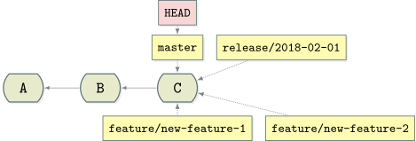

# Simple Release Flow

這是簡單釋版的流程，它基於 GitHub Flow ，加上使用 Git Flow 的三種臨時性分支，來解決 GitHub Flow 難以調整預發佈環境（staging）的問題。不僅解決問題，也保留像 GitHub Flow 一樣簡單的線圖。

適合情境：

* 除了線上環境外，還有預發佈環境
* 可頻繁交付至預發佈環境
* 流程簡單，使用 merge 即可解決常見的需求。

## Terms

* `production` - 線上環境
* `staging` - 預發佈環境
* `develop` - 開發環境
* `master` - Git 的預設 branch
* `feature` - 功能開發
* `release` - 釋出新版本 
* `hotfix` - 緊急 Bug 修復

## 分支（Branch）種類

參考 Git Flow，此工作流程的分支有以下四種：

* `master` - 這代表了線上環境目前的程式碼，同時這也是主要分支（mainline）
* `feature` - 開發用分支
* `release` - 發佈用分支
* `hotfix` - 緊急修復分支 

## 建立 Branch 與開發

當進入下一個 release 週期時，先在 `master` 建立新的 `release` 分支。如，下面是建立一個 `2018-02-01` release 分支的指令：

    git branch release/2018-02-01 master

接著開發 feature 則在 master 開新的 `feature` 分支。範例如下：

    git branch feature/new-feature-1 master
    git branch feature/new-feature-2 master

開發皆在 `feature` 分支處理。

## Staging 階段

此階段可決定有哪些 feature 要進入 staging 。這時使用 `git merge --squash` 將需要的 feature 併進 release 分支。比方說，只有 `feature/new-feature-2` 需要進入 staging ，先切到 `release/2018-02-01` 分支：

    git checkout release/2018-02-01

接著再使用 `git merge --squash` 把 `feature/new-feature-2` 壓成一個 commit 到 `release/2018-02-01` 分支上：

    git merge --squash feature/new-feature-2
    git commit

此時， release 分支就會包含 `feature/new-feature-2` 的內容（D+E）。

> 使用 `--squash` 可以讓線圖明確，對了解 release 內容有幫助。

### 調整內容

如果因為某些因素，需要調整 staging 的內容時，也非常簡單。比方說，`feature/new-feature-2` 要移除，改成 `feature/new-feature-1`。實際做法是，先把 `release/2018-02-01` 移除再重新建立，接著再依新的需求重新 merge 需要的 feature 分支即可：

    git branch -D release/2018-02-01
    git branch release/2018-02-01 master
    git checkout release/2018-02-01
    git merge --squash feature/new-feature-1
    git commit

因為 `release/2018-02-01` 是屬於臨時分支，commit 的生成會依賴即有的 `feature` 分支，因此它隨時都能刪除。

## 上線環境

最後，佈署至上線環境的方法也很簡單：將 `release/2018-02-01` 使用 `git merge --no-ff` 合併回 `master` 即可：

指令範例如下

    git checkout master
    git merge --no-ff release/2018-02-01

> 使用 `--no-ff` 可以讓線圖可以像 GitHub Flow 一樣簡單。

## Hotfix

當遇到線上錯誤需要緊急修正時，可以直接在 `master` 上開 `hotfix` 分支：

    git branch hotfix/fix-bug master

錯誤處理完之後，再把 hotfix 分支當成 release 分支處理：佈署到 staging 測試，最後 merge 回 `master` 上線：

    git checkout master
    git merge --no-ff hotfix/fix-bug

## 主分支更新

當主分支因某些理由更新（hotfix 或上線等），其他分支必須使用 rebase 更新：

    git checkout feature/other-feature
    git pull --rebase origin master

## 其他

建議：

* 因有固定 release 週期，因此建議要有 release owner 角色，由此角色來掌控 release 分支的調整

問題：

* 當非線上環境的其他開發測試環境有超過 2 個以上時，則建議改使用 GitLab Flow
